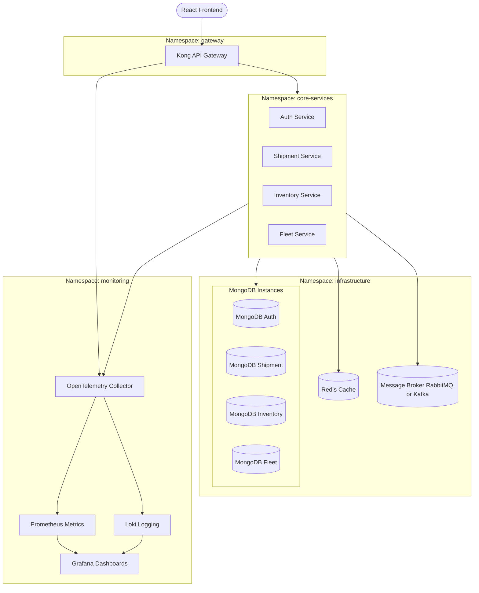

```mermaid
flowchart TB
    %% ===== Namespaces =====
    subgraph Gateway["Namespace: gateway"]
        KONG[Kong API Gateway]
    end

    subgraph CoreServices["Namespace: core-services"]
        AUTH[Auth Service]
        SHIP[Shipment Service]
        INV[Inventory Service]
        FLEET[Fleet Service]
    end

    subgraph Infra["Namespace: infrastructure"]
        subgraph DBS["MongoDB Instances"]
            M_AUTH[(MongoDB Auth)]
            M_SHIP[(MongoDB Shipment)]
            M_INV[(MongoDB Inventory)]
            M_FLEET[(MongoDB Fleet)]
        end
        REDIS[(Redis Cache)]
        BROKER[(Message Broker RabbitMQ or Kafka)]
    end

    subgraph Monitoring["Namespace: monitoring"]
        OTEL[OpenTelemetry Collector]
        LOKI[Loki Logging]
        PROM[Prometheus Metrics]
        GRAF[Grafana Dashboards]
    end


     %% ===== High-Level Connections =====
    USER([React Frontend]) --> KONG
    KONG --> CoreServices

    CoreServices --> BROKER
    CoreServices --> DBS
    CoreServices --> REDIS

    CoreServices --> OTEL
    KONG --> OTEL

    OTEL --> LOKI
    OTEL --> PROM
    PROM --> GRAF
    LOKI --> GRAF

```
