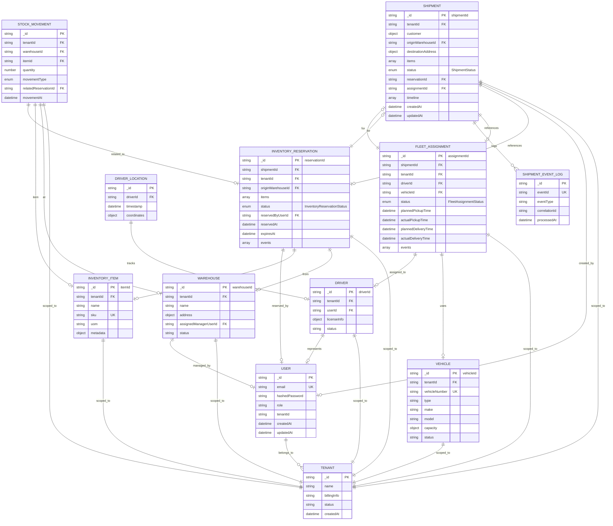

```mermaid
erDiagram
    %% Auth Service
    USER {
        string _id PK
        string email UK
        string hashedPassword
        string role
        string tenantId
        datetime createdAt
        datetime updatedAt
    }
    TENANT {
        string _id PK
        string name
        string billingInfo
        string status
        datetime createdAt
    }
    USER ||--o{ TENANT : "belongs_to"

    %% Shipment Service
    SHIPMENT {
        string _id PK "shipmentId"
        string tenantId FK
        object customer
        string originWarehouseId FK
        object destinationAddress
        array items
        enum status "ShipmentStatus"
        string reservationId FK
        string assignmentId FK
        array timeline
        datetime createdAt
        datetime updatedAt
    }
    SHIPMENT_EVENT_LOG {
        string _id PK
        string eventId UK
        string eventType
        string correlationId
        datetime processedAt
    }
    SHIPMENT ||--|| TENANT : "scoped_to"
    SHIPMENT ||--o| USER : "created_by"
    SHIPMENT ||--o| INVENTORY_RESERVATION : "references"
    SHIPMENT ||--o| FLEET_ASSIGNMENT : "references"
    SHIPMENT ||--o{ SHIPMENT_EVENT_LOG : "logs"

    %% Inventory Service
    WAREHOUSE {
        string _id PK "warehouseId"
        string tenantId FK
        string name
        object address
        string assignedManagerUserId FK
        string status
    }
    INVENTORY_ITEM {
        string _id PK "itemId"
        string tenantId FK
        string name
        string sku UK
        string uom
        object metadata
    }
    INVENTORY_RESERVATION {
        string _id PK "reservationId"
        string shipmentId FK
        string tenantId FK
        string originWarehouseId FK
        array items
        enum status "InventoryReservationStatus"
        string reservedByUserId FK
        datetime reservedAt
        datetime expiresAt
        array events
    }
    STOCK_MOVEMENT {
        string _id PK
        string tenantId FK
        string warehouseId FK
        string itemId FK
        number quantity
        enum movementType
        string relatedReservationId FK
        datetime movementAt
    }
    
    WAREHOUSE ||--|| TENANT : "scoped_to"
    WAREHOUSE ||--o| USER : "managed_by"
    INVENTORY_ITEM ||--|| TENANT : "scoped_to"
    INVENTORY_RESERVATION ||--|| TENANT : "scoped_to"
    INVENTORY_RESERVATION ||--o| WAREHOUSE : "from"
    INVENTORY_RESERVATION ||--o| INVENTORY_ITEM : "items"
    INVENTORY_RESERVATION ||--o| USER : "reserved_by"
    INVENTORY_RESERVATION ||--o| SHIPMENT : "for"
    STOCK_MOVEMENT ||--|| TENANT : "scoped_to"
    STOCK_MOVEMENT ||--o| WAREHOUSE : "at"
    STOCK_MOVEMENT ||--o| INVENTORY_ITEM : "item"
    STOCK_MOVEMENT ||--o| INVENTORY_RESERVATION : "related_to"

    %% Fleet Service
    VEHICLE {
        string _id PK "vehicleId"
        string tenantId FK
        string vehicleNumber UK
        string type
        string make
        string model
        object capacity
        string status
    }
    DRIVER {
        string _id PK "driverId"
        string tenantId FK
        string userId FK
        object licenseInfo
        string status
    }
    FLEET_ASSIGNMENT {
        string _id PK "assignmentId"
        string shipmentId FK
        string tenantId FK
        string driverId FK
        string vehicleId FK
        enum status "FleetAssignmentStatus"
        datetime plannedPickupTime
        datetime actualPickupTime
        datetime plannedDeliveryTime
        datetime actualDeliveryTime
        array events
    }
    DRIVER_LOCATION {
        string _id PK
        string driverId FK
        datetime timestamp
        object coordinates
    }
    
    VEHICLE ||--|| TENANT : "scoped_to"
    DRIVER ||--|| TENANT : "scoped_to"
    DRIVER ||--o| USER : "represents"
    FLEET_ASSIGNMENT ||--|| TENANT : "scoped_to"
    FLEET_ASSIGNMENT ||--o| VEHICLE : "uses"
    FLEET_ASSIGNMENT ||--o| DRIVER : "assigned_to"
    FLEET_ASSIGNMENT ||--o| SHIPMENT : "for"
    DRIVER_LOCATION ||--o| DRIVER : "tracks"

```