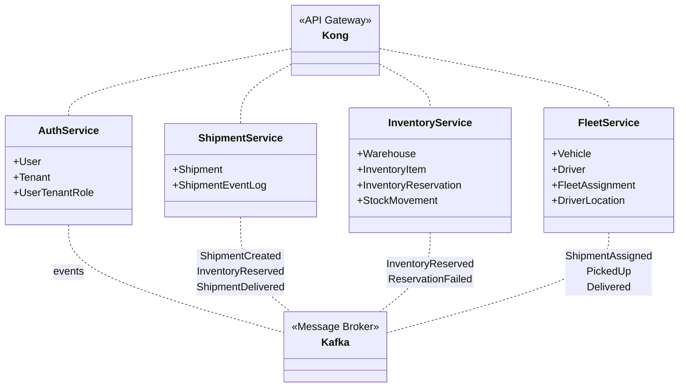

```mermaid
classDiagram
    class AuthService {
        +User
        +Tenant
        +UserTenantRole
    }

    class ShipmentService {
        +Shipment
        +ShipmentEventLog
    }

    class InventoryService {
        +Warehouse
        +InventoryItem
        +InventoryReservation
        +StockMovement
    }

    class FleetService {
        +Vehicle
        +Driver
        +FleetAssignment
        +DriverLocation
    }

    class Kafka {
        <<Message Broker>>
    }

    class Kong {
        <<API Gateway>>
    }

    AuthService .. Kafka : events
    ShipmentService .. Kafka : ShipmentCreated<br/>InventoryReserved<br/>ShipmentDelivered
    InventoryService .. Kafka : InventoryReserved<br/>ReservationFailed
    FleetService .. Kafka : ShipmentAssigned<br/>PickedUp<br/>Delivered

    Kong .. ShipmentService
    Kong .. InventoryService
    Kong .. FleetService
    Kong .. AuthService

```
