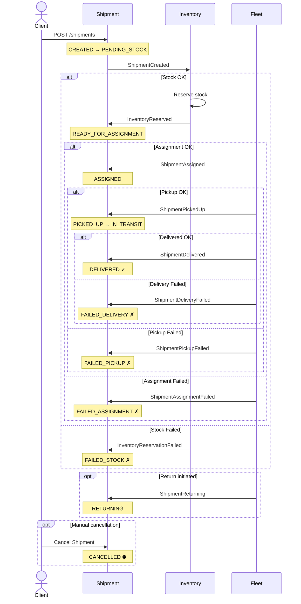

```mermaid
sequenceDiagram
    actor C as Client
    participant S as Shipment
    participant I as Inventory
    participant F as Fleet

    %% Shipment Creation
    C->>S: POST /shipments
    Note over S: CREATED → PENDING_STOCK
    S->>I: ShipmentCreated

    %% Stock Reservation Flow
    alt Stock OK
        I->>I: Reserve stock
        I->>S: InventoryReserved
        Note over S: READY_FOR_ASSIGNMENT

        %% Assignment Flow
        alt Assignment OK
            F->>S: ShipmentAssigned
            Note over S: ASSIGNED

            %% Pickup Flow
            alt Pickup OK
                F->>S: ShipmentPickedUp
                Note over S: PICKED_UP → IN_TRANSIT

                %% Delivery Flow
                alt Delivered OK
                    F->>S: ShipmentDelivered
                    Note over S: DELIVERED ✓
                else Delivery Failed
                    F->>S: ShipmentDeliveryFailed
                    Note over S: FAILED_DELIVERY ✗
                end

            else Pickup Failed
                F->>S: ShipmentPickupFailed
                Note over S: FAILED_PICKUP ✗
            end

        else Assignment Failed
            F->>S: ShipmentAssignmentFailed
            Note over S: FAILED_ASSIGNMENT ✗
        end

    else Stock Failed
        I->>S: InventoryReservationFailed
        Note over S: FAILED_STOCK ✗
    end

    %% Return Flow
    opt Return initiated
        F->>S: ShipmentReturning
        Note over S: RETURNING
    end

    %% Cancellation Flow
    opt Manual cancellation
        C->>S: Cancel Shipment
        Note over S: CANCELLED ⛔
    end

```